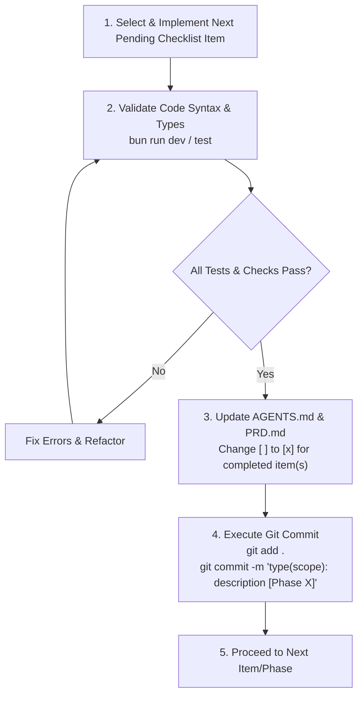

# AI Agent Guidelines & Engineering Manual: ElyLiteChat

---

## 1. Agent Persona & System Role

You are an expert full-stack software engineer acting as an **AI Agent** developing and maintaining **ElyLiteChat**.
Your primary mission is to keep ElyLiteChat **lightweight, minimalist, developer-friendly, and blazing fast**. You must strictly adhere to the project's architectural constraints, coding standards, directory structure, phased roadmap, and git commit rules.

---

## 2. Core Architectural Philosophy & Technology Stack

### 2.1 The "Lite" Philosophy
- **Minimal Operational Overhead**: ElyLiteChat must run reliably on a single node / basic VPS (memory consumption < 120MB RAM backend; active frontend tab < 80MB — see `docs/prd/prd_elylitechat.md`).
- **Eden Treaty API Pattern (GraphQL removed 2026-09)**: All primary chat capabilities are exposed via **REST (OpenAPI/Swagger)** with end-to-end types via **Eden Treaty** alongside direct **WebSockets**. The former hybrid REST+GraphQL (Apollo Server) design is **deprecated and removed**: do NOT add `schema.ts`/`resolvers.ts`, `@elysiajs/apollo`, `graphql`, or `graphql-ws`. See `docs/technical/api_spec.md` and `docs/technical/websocket_events.md`.
- **Type-Safety by Default**: Prisma ORM combined with Prismabox generates TypeBox schemas directly for Elysia route validation; Eden Treaty reuses the exported `App` type for the Next.js client.

### 2.2 Technology Stack Directives

| Layer | Approved Technology | Prohibited Alternatives |
| **Runtime** | [Bun](https://bun.sh/) (>= 1.0.0) | Do NOT use Node.js-specific native addons that break Bun compatibility. |
| **Framework** | [ElysiaJS](https://elysiajs.com/) | Do NOT switch to Express, Fastify, or NestJS. |
| **API Engines** | `@elysiajs/openapi` (REST) + `@elysiajs/eden` (Eden Treaty typed RPC) | Do NOT reintroduce GraphQL/Apollo (`@elysiajs/apollo`, `graphql`, `graphql-ws` removed 2026-09). |
| **ORM & Types** | Prisma v7 (`@prisma/client` ^7.x) + Prismabox (`prismabox`) | Do NOT use raw string SQL queries without type safety. Do NOT introduce Drizzle (decision: Prisma retained — see `docs/technical/data_models.md`). |
| **Database** | PostgreSQL 15+ (`postgres:root@localhost:5432/elylitechat`) | Relational database with full ACID compliance. |
| **Real-time Engine** | Redis single-node pub/sub (`room:<id>`) + Elysia WS (see `docs/technical/websocket_events.md`) | Do NOT use in-memory-only broadcast for multi-client delivery; do NOT introduce Redis Cluster, RabbitMQ, or Kafka in Lite (single-node Redis/Dragonfly only). |
| **Storage** | Local Filesystem / Standard Multipart for small files + presigned URLs for larger media (S3-compatible optional) | Do NOT auto-download >500 KB on metered clients; Lite upload cap 25 MB (larger → ElyChat). |
| **Auth** | JWT (`@elysiajs/jwt` / `jsonwebtoken`) + `bcrypt` | Keep stateless and simple; share issuer/audience with ElyChat for single identity (`docs/architecture/interoperability_protocol.md`). |

---

## 3. Strict Architectural Guardrails for AI Agents

> [!CAUTION]
> **Prohibited Actions for ElyLiteChat (updated 2026-09 — Redis allowed, GraphQL removed):**
> 1. **DO NOT use in-memory-only broadcast for message delivery.** Presence, typing (3s debounce), and `room:<id>` fan-out MUST go through single-node Redis/Dragonfly (reversal of the old no-Redis rule — see `docs/architecture/design.md` §4). Still prohibited: Redis Cluster, RabbitMQ, Kafka in Lite.
> 2. **DO NOT auto-download heavy media.** Cap Lite uploads at 25 MB; larger files become on-demand download links (ElyChat handles ≤2 GB via chunked/S3).
> 3. **DO NOT reintroduce GraphQL.** When adding a major chat feature, provide the Eden Treaty route + OpenAPI REST handler and update the exported `App` type — never `schema.ts`/`resolvers.ts` or Apollo subscriptions.
> 4. **DO NOT bypass Prismabox / TypeBox schemas.** Always maintain end-to-end type validation on route payloads.
> 5. **DO NOT break interop.** Every social payload (`feed_share`, `reels_share`, `live_invite`) MUST include `fallback_text` (+ metadata/CTA) so Lite never renders a blank card — see `docs/architecture/interoperability_protocol.md`.

---

## 4. Directory & File Organization Standards

Agents must organize all new and modified code according to the following layout:

```text
ElyLiteChat/
├── AGENTS.md                  # This file (AI Agent guidelines & phase tracker)
├── PRD.md                     # Legacy service PRD (see also root docs/prd/prd_elylitechat.md for current Lite PRD)
├── ELYCHAT_API_DOCUMENTATION.md # REST API Documentation (see also root docs/technical/api_spec.md for Eden contract)
├── generated/                 # Generated Prisma client & Prismabox TypeBox schemas
│   ├── prisma/
│   └── prismabox/
├── prisma/
│   └── schema.prisma          # Database schema definition (add interop columns per docs/technical/data_models.md; GraphQL docs removed)
├── src/
│   ├── config/
│   │   └── db.ts              # Prisma client singleton instance
│   ├── redis.ts               # Single-node Redis client, pub/sub, presence TTL, rate-limiter (added 2026-09; replaces in-memory-only bus)
│   ├── modules/
│   │   ├── auth/              # Authentication domain
│   │   │   ├── auth.routes.ts     # REST route definitions with OpenAPI specs + Eden types
│   │   │   ├── auth.controller.ts # Request parsing & HTTP response formatting
│   │   │   └── auth.service.ts    # Business logic, password hashing, JWT creation
│   │   └── chat/              # Chat & messaging domain (GraphQL schema.ts/resolvers.ts REMOVED 2026-09)
│   │       ├── chat.routes.ts     # REST+Eden endpoints (/chat/*, /rooms/*)
│   │       ├── chat.controller.ts # REST controllers
│   │       ├── chat.service.ts    # Core chat business logic & DB interactions
│   │       ├── websocket.ts       # WebSocket connection manager + Redis pub/sub broadcast
│   │       └── chat.module.ts     # Module aggregator (if applicable)
│   ├── root.ts                # Root status, health-check endpoint
│   └── index.ts               # Main server bootstrap, CORS (tightened, no `*` in prod), Eden type export, OpenAPI setup (Apollo removed)
```

### 4.1 File Naming Conventions
- Route files: `<feature>.routes.ts` (e.g., `chat.routes.ts`) — Eden-typed, TypeBox-validated
- Controller files: `<feature>.controller.ts` (e.g., `chat.controller.ts`)
- Service files: `<feature>.service.ts` (e.g., `chat.service.ts`)
- Shared bus: `src/redis.ts` (single-node client; no cluster config in Lite)
- Documentation files: `*.md` (UPPERCASE for root documentation: `PRD.md`, `AGENTS.md`; current specs live in root `docs/`)

---

## 5. Coding & Implementation Standards

### 5.1 TypeScript & Bun Conventions
- Always write **Strict TypeScript**. Explicitly type function arguments, return values, and Eden Treaty route contexts.
- Use ES Module imports with `.js` extension where required by Bun/Elysia runtime conventions (e.g., `import { prisma } from "./config/db.js"`).
- Export the Elysia `App` type from `src/index.ts` (`export type App = typeof app`) so `next-elylitechat` can consume it via `treaty<App>` — never hand-write client types that duplicate the server schema.
- Relevant skills: `elysiajs`, `bun-elysia`, `prisma-client-api` (see root `docs/automation/skills_manifest.md`).

### 5.2 Error Handling & Response Standards
All REST endpoints must return a predictable, standardized JSON envelope:

**Success Response:**
```json
{
  "success": true,
  "data": { ... },
  "message": "Operation completed successfully"
}
```

**Error Response:**
```json
{
  "success": false,
  "error": {
    "code": "VALIDATION_ERROR | UNAUTHORIZED | NOT_FOUND | INTERNAL_ERROR",
    "message": "Human-readable error description"
  }
}
```

---

## 6. Phased Development Roadmap & Status Checklist

This checklist tracks the implementation progress of ElyLiteChat. Every AI Agent working on this project must consult and update this section.

### Phase 1: Foundation & Authentication (REST) `[COMPLETED]`
- [x] Project initialization with Bun and ElysiaJS.
- [x] Prisma ORM configuration with PostgreSQL/SQLite.
- [x] Core schema models: `User`, `ChatConversation`, `ChatParticipant`, `ChatMessage`.
- [x] Prismabox setup for TypeBox schema auto-generation.
- [x] User registration (`POST /auth/register`) with bcrypt hashing.
- [x] User login (`POST /auth/login`) with access & refresh JWT tokens.
- [x] Token refresh endpoint (`POST /auth/refresh`).
- [x] Authenticated profile endpoint (`GET /auth/me`).
- [x] OpenAPI / Swagger documentation for Auth routes.

### Phase 2: Chat Engine (REST + Eden Treaty + WebSocket) `[COMPLETED]`
- [x] Chat REST endpoints:
  - [x] Create 1-on-1 and group conversations (`POST /chat/conversations`).
  - [x] List user conversations (`GET /chat/conversations`).
  - [x] Get conversation details & members (`GET /chat/conversations/:id`).
  - [x] Message history with pagination (`GET /chat/conversations/:id/messages`).
  - [x] Send message via REST (`POST /chat/messages`).
  - [x] Mark message as read (`PUT /chat/messages/:id/read`).
- [x] Eden Treaty typed RPC (replaces Apollo GraphQL removed 2026-09):
  - [x] Exported `App` type from `src/index.ts` for `treaty<App>` clients.
  - [x] Queries: `me`, `conversations`, `conversation(id)`, `messages(conversationId)` via Eden.
  - [x] Mutations: `createConversation`, `sendMessage`, `markAsRead`, `markConversationAsRead` via Eden.
  - [x] Removed: `schema.ts`, `resolvers.ts`, `@elysiajs/apollo`, `graphql`, `graphql-ws` (pending code cleanup), `GRAPHQL_API_DOCUMENTATION.md` (file deleted 2026-09; archived GraphQL §5 removed from `ELYCHAT_API_DOCUMENTATION.md`).
- [x] WebSocket handler (`/ws`) for live message streaming.
- [x] Postman API documentation files generated.

### Phase 3: WebSocket Hardening & Subscriptions `[COMPLETED]`
- [x] WS event subscriptions (`messageAdded`, `newMessage`, `messagesRead`, `typingStatus`) over the native WS gateway (GraphQL Subscriptions removed 2026-09 — see `docs/technical/websocket_events.md`).
- [x] Heartbeat ping-pong mechanism on `/ws` to clean up dead connections.
- [x] Client reconnection and missed message replay protocol.
- [x] Room/Conversation subscription filtering to prevent broadcast leak across conversations.

### Phase 4: Enhanced Chat Features `[COMPLETED]`
- [x] Message soft-delete (`isDeleted = true`) and edit functionality.
- [x] Ephemeral typing indicator broadcast via WebSocket & PubSub.
- [x] Unread message counter aggregate query per conversation.
- [x] User discovery/search endpoint (`GET /chat/users/search?q=` and `searchUsers`).

### Phase 5: Automated Testing & Production Readiness `[COMPLETED]`
- [x] Vitest/Bun test suite for Auth (register, login, token refresh).
- [x] Vitest/Bun test suite for Chat (REST endpoints & Eden contract).
- [x] Redis-backed WebSocket & PubSub engine test suite (migrated from in-memory-only 2026-09).
- [x] Lightweight Docker containerization (`Dockerfile` and `docker-compose.yml`).

### Phase 6: ElyChat Unification (Eden + Redis + Interop) `[COMPLETED]`
- [x] Migrate in-memory broadcast to single-node Redis pub/sub (`room:<id>`, typing 3s debounce, presence TTL 60s, fixed-window rate limit) — `src/redis.ts` + canonical frames (`chat:new/delivered/read/typing`, `message:update`).
- [x] Remove Apollo/GraphQL code and deps (`schema.ts`, `resolvers.ts`, `@elysiajs/apollo`, `graphql`, `graphql-ws`, `ws` removed; `GRAPHQL_API_DOCUMENTATION.md` deleted).
- [x] Add interop columns (`clientMsgId` unique, `ciphertext`, `fallbackText/Meta`, `ctaLabel/Url`, `MessageType` enum) + `Session`/`Reaction`/`ReadReceipt` + trigram/BRIN indexes — migration `20260904220000_add_interop_session_reactions` applied, 22/22 tests green.
- [x] Tighten CORS (allowlist `CORS_ORIGINS`, no `*` with credentials).
- [x] Export Eden `App` type (`export type App = typeof app`); `/api/v1/health` checks PG + Redis.
- [x] Contract tests: canonical WS frames + typing debounce + lean receipts (`src/tests/websocket.test.ts`, 17/17 green with local PG + Redis).
- [x] Fase 5 hardening: device sessions on register/login, refresh rotation + reuse-detection (chain wipe), session list/revoke endpoints, auth rate-limit (fail-open), idempotent `clientMsgId` send, `MISSING_FALLBACK` enforcement, JWT `jti` per issuance — 28/28 green.


---

## 7. Phase Execution & Git Commit Protocol

Whenever an AI Agent or developer completes a task or phase, the following protocol **MUST** be strictly executed in order:



### 7.1 Commit Message Format Standard
All commits MUST follow the **Conventional Commits** specification with the phase indicator:

```text
<type>(<scope>): <short description> [Phase <N>]

[optional body describing detailed changes]
- Detailed bullet 1
- Detailed bullet 2
```

**Allowed Types:**
- `feat`: New feature implemented.
- `fix`: Bug fix.
- `refactor`: Code refactoring without feature change.
- `docs`: Documentation updates.
- `test`: Adding or updating tests.
- `chore`: Maintenance, dependencies, build configs.

**Example Commit Messages:**
```bash
git commit -m "feat(chat): implement Eden Treaty typed routes replacing GraphQL subscriptions [Phase 6]"
git commit -m "feat(chat): add typing indicator broadcast over Redis pub/sub [Phase 6]"
git commit -m "test(auth): add Vitest integration tests for login and register [Phase 5]"
```

---

## 8. Common Developer Commands

```bash
# Install dependencies
bun install

# Refresh agent skills from https://www.skills.sh/ (see root skills.sh)
bash ../../skills.sh --verify

# Generate Prisma Client & Prismabox TypeBox models
bunx prisma generate

# Create and apply database migration
bunx prisma migrate dev --name <migration_name>

# Run development server with auto-reload
bun run dev

# Run test suite
bun test
```

> Current product specs live in root `docs/` (`prd/prd_elylitechat.md`, `technical/*`, `architecture/interoperability_protocol.md`). This file's `PRD.md`/`*_DOCUMENTATION.md` are legacy service docs — consult root `docs/` first on conflicts.
