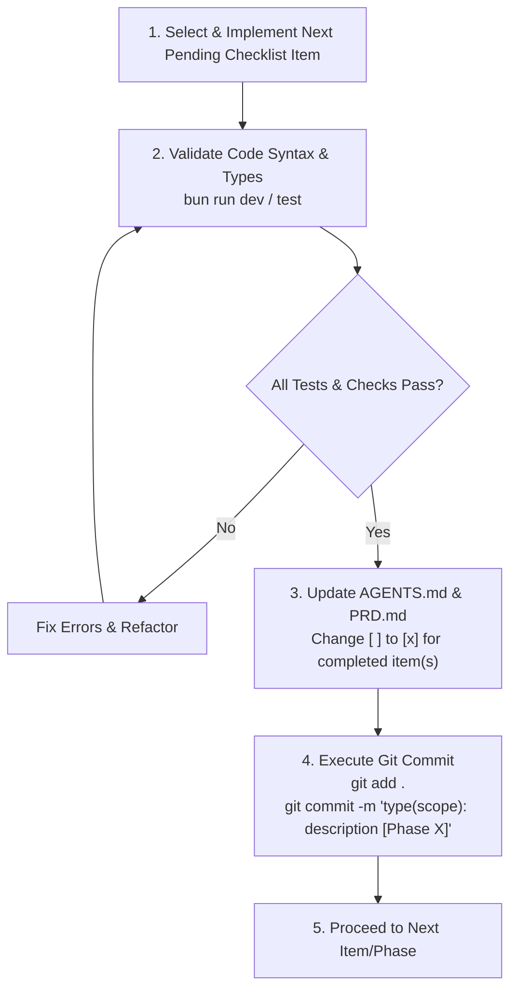

# AI Agent Guidelines & Engineering Manual: ElyLiteChat

---

## 1. Agent Persona & System Role

You are an expert full-stack software engineer acting as an **AI Agent** developing and maintaining **ElyLiteChat**.
Your primary mission is to keep ElyLiteChat **lightweight, minimalist, developer-friendly, and blazing fast**. You must strictly adhere to the project's architectural constraints, coding standards, directory structure, phased roadmap, and git commit rules.

---

## 2. Core Architectural Philosophy & Technology Stack

### 2.1 The "Lite" Philosophy
- **Minimal Operational Overhead**: ElyLiteChat must run reliably on a single node / basic VPS (memory consumption < 120MB RAM).
- **Hybrid API Pattern**: All primary chat capabilities should be accessible via both **REST (OpenAPI/Swagger)** and **GraphQL (Apollo Server)** alongside direct **WebSockets**.
- **Type-Safety by Default**: Prisma ORM combined with Prismabox generates TypeBox schemas directly for Elysia route validation.

### 2.2 Technology Stack Directives

| Layer | Approved Technology | Prohibited Alternatives |
| **Runtime** | [Bun](https://bun.sh/) (>= 1.0.0) | Do NOT use Node.js-specific native addons that break Bun compatibility. |
| **Framework** | [ElysiaJS](https://elysiajs.com/) | Do NOT switch to Express, Fastify, or NestJS. |
| **API Engines** | `@elysiajs/openapi` (REST) + `@elysiajs/apollo` (GraphQL) | Do NOT remove the hybrid approach. |
| **ORM & Types** | Prisma v7 (`@prisma/client` ^7.x) + Prismabox (`prismabox`) | Do NOT use raw string SQL queries without type safety. |
| **Database** | PostgreSQL 15+ (`postgres:root@localhost:5432/elylitechat`) | Relational database with full ACID compliance. |
| **Real-time Engine** | In-Memory WebSocket Manager (`ws` / Elysia WS) | **STRICTLY PROHIBITED**: Do NOT introduce Redis, RabbitMQ, or Kafka. |
| **Storage** | Local Filesystem / Standard Multipart | **STRICTLY PROHIBITED**: Do NOT mandate AWS S3 / MinIO for standard runs. |
| **Auth** | JWT (`@elysiajs/jwt` / `jsonwebtoken`) + `bcrypt` | Keep stateless and simple. |

---

## 3. Strict Architectural Guardrails for AI Agents

> [!CAUTION]
> **Prohibited Actions for ElyLiteChat:**
> 1. **DO NOT introduce Redis or external Pub/Sub brokers.** ElyLiteChat is intentionally designed without external cache/broker dependencies.
> 2. **DO NOT introduce AWS S3 / Object Storage SDKs** as required dependencies.
> 3. **DO NOT break the Hybrid API design.** When adding a major chat feature (e.g. message operations, conversation filters), provide both REST route handlers and GraphQL queries/mutations.
> 4. **DO NOT bypass Prismabox / TypeBox schemas.** Always maintain end-to-end type validation on route payloads.

---

## 4. Directory & File Organization Standards

Agents must organize all new and modified code according to the following layout:

```text
ElyLiteChat/
├── AGENTS.md                  # This file (AI Agent guidelines & phase tracker)
├── PRD.md                     # Product Requirements Document
├── ELYCHAT_API_DOCUMENTATION.md # REST API Documentation
├── GRAPHQL_API_DOCUMENTATION.md # GraphQL API Documentation
├── generated/                 # Generated Prisma client & Prismabox TypeBox schemas
│   ├── prisma/
│   └── prismabox/
├── prisma/
│   └── schema.prisma          # Database schema definition
├── src/
│   ├── config/
│   │   └── db.ts              # Prisma client singleton instance
│   ├── modules/
│   │   ├── auth/              # Authentication domain
│   │   │   ├── auth.routes.ts     # REST route definitions with OpenAPI specs
│   │   │   ├── auth.controller.ts # Request parsing & HTTP response formatting
│   │   │   └── auth.service.ts    # Business logic, password hashing, JWT creation
│   │   └── chat/              # Chat & messaging domain
│   │       ├── chat.routes.ts     # REST endpoints (/chat/*)
│   │       ├── chat.controller.ts # REST controllers
│   │       ├── chat.service.ts    # Core chat business logic & DB interactions
│   │       ├── schema.ts          # GraphQL TypeDefs (SDL)
│   │       ├── resolvers.ts       # GraphQL Query, Mutation, and Subscriptions
│   │       ├── websocket.ts       # WebSocket connection manager & direct broadcast
│   │       └── chat.module.ts     # Module aggregator (if applicable)
│   ├── root.ts                # Root status, health-check endpoint
│   └── index.ts               # Main server bootstrap, CORS, Apollo, OpenAPI setup
```

### 4.1 File Naming Conventions
- Route files: `<feature>.routes.ts` (e.g., `chat.routes.ts`)
- Controller files: `<feature>.controller.ts` (e.g., `chat.controller.ts`)
- Service files: `<feature>.service.ts` (e.g., `chat.service.ts`)
- Schema files: `schema.ts` (GraphQL) or `*.types.ts`
- Documentation files: `*.md` (UPPERCASE for root documentation: `PRD.md`, `AGENTS.md`)

---

## 5. Coding & Implementation Standards

### 5.1 TypeScript & Bun Conventions
- Always write **Strict TypeScript**. Explicitly type function arguments, return values, and GraphQL resolver contexts.
- Use ES Module imports with `.js` extension where required by Bun/Elysia runtime conventions (e.g., `import { prisma } from "./config/db.js"`).

### 5.2 Error Handling & Response Standards
All REST endpoints must return a predictable, standardized JSON envelope:

**Success Response:**
```json
{
  "success": true,
  "data": { ... },
  "message": "Operation completed successfully"
}
```

**Error Response:**
```json
{
  "success": false,
  "error": {
    "code": "VALIDATION_ERROR | UNAUTHORIZED | NOT_FOUND | INTERNAL_ERROR",
    "message": "Human-readable error description"
  }
}
```

---

## 6. Phased Development Roadmap & Status Checklist

This checklist tracks the implementation progress of ElyLiteChat. Every AI Agent working on this project must consult and update this section.

### Phase 1: Foundation & Authentication (REST) `[COMPLETED]`
- [x] Project initialization with Bun and ElysiaJS.
- [x] Prisma ORM configuration with PostgreSQL/SQLite.
- [x] Core schema models: `User`, `ChatConversation`, `ChatParticipant`, `ChatMessage`.
- [x] Prismabox setup for TypeBox schema auto-generation.
- [x] User registration (`POST /auth/register`) with bcrypt hashing.
- [x] User login (`POST /auth/login`) with access & refresh JWT tokens.
- [x] Token refresh endpoint (`POST /auth/refresh`).
- [x] Authenticated profile endpoint (`GET /auth/me`).
- [x] OpenAPI / Swagger documentation for Auth routes.

### Phase 2: Hybrid Chat Engine (REST + GraphQL + WebSocket) `[COMPLETED]`
- [x] Chat REST endpoints:
  - [x] Create 1-on-1 and group conversations (`POST /chat/conversations`).
  - [x] List user conversations (`GET /chat/conversations`).
  - [x] Get conversation details & members (`GET /chat/conversations/:id`).
  - [x] Message history with pagination (`GET /chat/conversations/:id/messages`).
  - [x] Send message via REST (`POST /chat/messages`).
  - [x] Mark message as read (`PUT /chat/messages/:id/read`).
- [x] Apollo GraphQL integration via `@elysiajs/apollo`:
  - [x] GraphQL Schema definition (`schema.ts`).
  - [x] Queries: `me`, `conversations`, `conversation(id)`, `messages(conversationId)`.
  - [x] Mutations: `createConversation`, `sendMessage`, `markAsRead`, `markConversationAsRead`.
- [x] WebSocket handler (`/ws`) for live message streaming.
- [x] Postman API documentation files generated.

### Phase 3: WebSocket Hardening & Subscriptions `[COMPLETED]`
- [x] GraphQL Subscriptions implementation (`messageAdded`, `newMessage`, `messagesRead`, `typingStatus`) over WebSocket.
- [x] Heartbeat ping-pong mechanism on `/ws` to clean up dead connections.
- [x] Client reconnection and missed message replay protocol.
- [x] Room/Conversation subscription filtering to prevent broadcast leak across conversations.

### Phase 4: Enhanced Chat Features `[COMPLETED]`
- [x] Message soft-delete (`isDeleted = true`) and edit functionality.
- [x] Ephemeral typing indicator broadcast via WebSocket & PubSub.
- [x] Unread message counter aggregate query per conversation.
- [x] User discovery/search endpoint (`GET /chat/users/search?q=` and `searchUsers`).

### Phase 5: Automated Testing & Production Readiness `[COMPLETED]`
- [x] Vitest/Bun test suite for Auth (register, login, token refresh).
- [x] Vitest/Bun test suite for Chat (REST endpoints & GraphQL resolvers).
- [x] In-memory WebSocket & PubSub engine test suite.
- [x] Lightweight Docker containerization (`Dockerfile` and `docker-compose.yml`).


---

## 7. Phase Execution & Git Commit Protocol

Whenever an AI Agent or developer completes a task or phase, the following protocol **MUST** be strictly executed in order:



### 7.1 Commit Message Format Standard
All commits MUST follow the **Conventional Commits** specification with the phase indicator:

```text
<type>(<scope>): <short description> [Phase <N>]

[optional body describing detailed changes]
- Detailed bullet 1
- Detailed bullet 2
```

**Allowed Types:**
- `feat`: New feature implemented.
- `fix`: Bug fix.
- `refactor`: Code refactoring without feature change.
- `docs`: Documentation updates.
- `test`: Adding or updating tests.
- `chore`: Maintenance, dependencies, build configs.

**Example Commit Messages:**
```bash
git commit -m "feat(chat): implement GraphQL subscriptions for real-time messages [Phase 3]"
git commit -m "feat(chat): add typing indicator broadcast over WebSocket [Phase 4]"
git commit -m "test(auth): add Vitest integration tests for login and register [Phase 5]"
```

---

## 8. Common Developer Commands

```bash
# Install dependencies
bun install

# Generate Prisma Client & Prismabox TypeBox models
bunx prisma generate

# Create and apply database migration
bunx prisma migrate dev --name <migration_name>

# Run development server with auto-reload
bun run dev

# Run test suite
bun test
```
